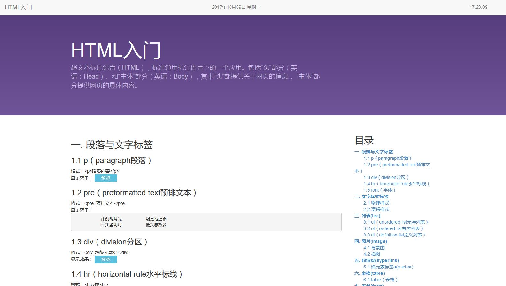

# Multimedia Course Projects Collection

It is the collection of all my homework projects of the course *Multimedia Technology and Applications* in the first semester of my Master of Engineering program, which contains the implementations of some classical data compression algorithms, basic website technology, some desktop applications and so on.

Some brief introduction of every single project will be listed in the following part, but for more details, please check out the subfolders of the related projects, and there is a detail report describing what is the project and how to run it in every single subproject.

## [Entropy](01_entropy/)

The python implementation of three data compression algorithms, including Huffman coding, Arithmetic coding and LZW coding.

## JPEG Codec

The python implementation of part of the JPEG image encoder and decoder algorithm.

## HTML

A basic webpage, aims to use as many HTML elements as possible.

## JavaScript

A simple try of javascript, including a geek style webpage digital clock and an interactive HTML learning page.

## ImgPro (Image Processing)

A simple image processing desktop application based on PyQt4

## UniqImg (Unique Image)

A simple application for removing similar images in the selected path. Based on PyQt4.

